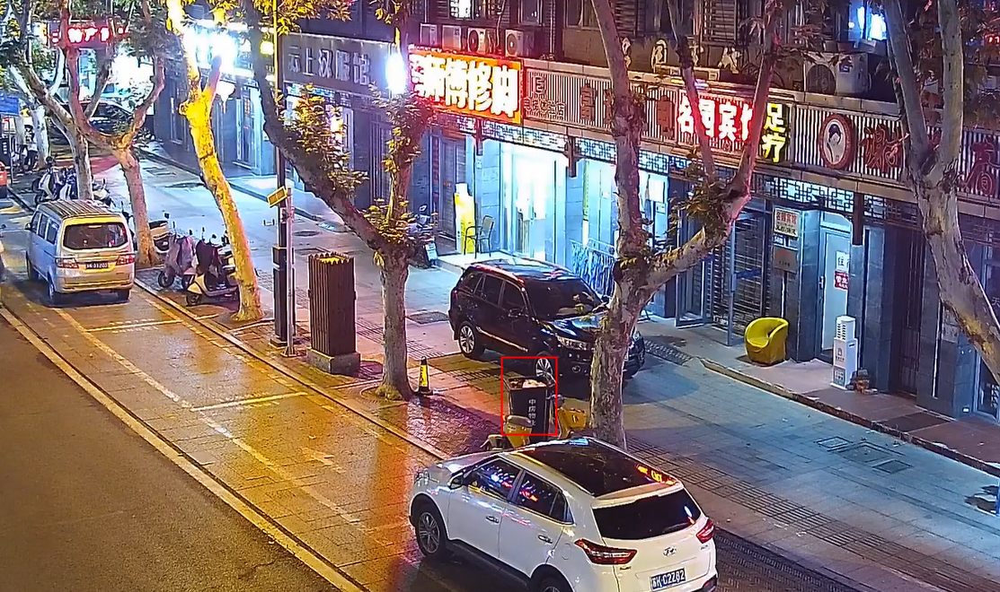
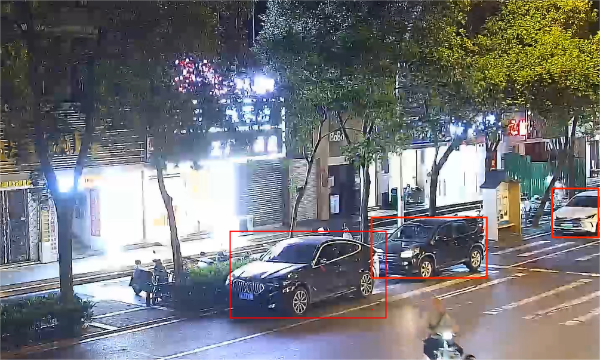
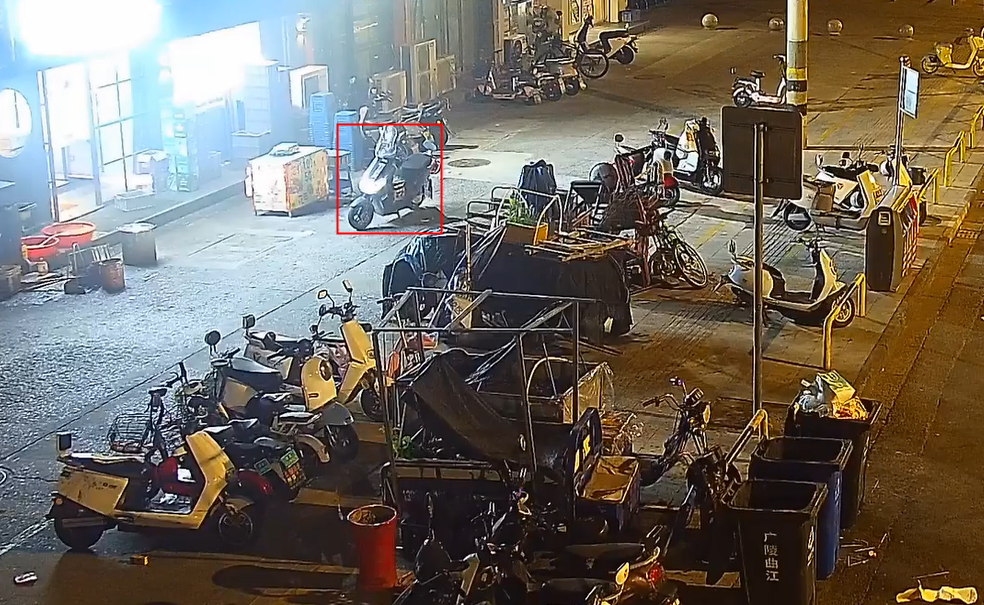
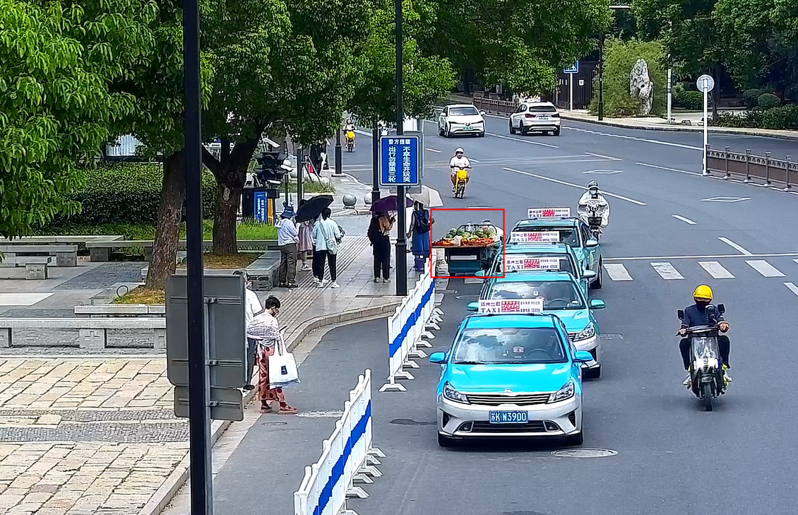
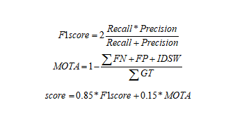

# 2024“大运河杯”数据开发应用创新大赛-CV方向

**语言**

[English](./README-EN.md)     [中文](./README.md)

# 1. 项目简介

本项目是**2024“大运河杯”数据开发应用创新大赛-CV方向**的参赛代码。

目标是通过开发一套智能识别系统，能够自动检测和分类城市管理中的违规行为。

该系统应利用先进的图像处理和计算机视觉技术，通过对摄像头捕获的视频进行分析，自动准确识别违规行为，并及时向管理部门发出告警，以实现更高效的城市管理。

最终排名142/522，实现了高级预处理和超参数调优，增强F1和MOTA指标。

# 2.比赛简介

**一、赛事背景**

为深入学习贯彻习近平总书记关于大运河文化保护传承利用的重要论述，紧扣数字中国、数字江苏部署要求，聚焦发展新质生产力，全面激发数据应用开发创新活力，充分发挥数据要素乘数效应，赋能经济社会发展。

**二、主题时间**

**主题：**数聚运河  扬舟天下

**时间：**2024年7月-9月

**三、组织架构**

指导单位：江苏省数据局

主办单位：扬州市人民政府、国家信息中心

承办单位：江苏省大数据管理中心、扬州市数据局

协办单位：中国科学院虚拟经济与数据科学研究中心、江苏大数据联盟、扬州大数据集团、中国电信扬州分公司、中国移动扬州分公司、中国联通扬州分公司、江苏银行扬州分行 、扬州大数据集团

技术支持单位：南京南数数据运筹科学研究院

**四、赛道设置**

城市治理赛道——随着城市化进程的加快，城市管理面临着前所未有的挑战。占道经营、垃圾堆放和无照经营游商等问题对城市管理提出了更高的要求。本赛道聚焦城市违规行为的智能检测，要求选手研究开发高效可靠的计算机视觉算法，提升违规行为检测识别的准确度，降低对大量人工的依赖，提升检测效果和效率，从而推动城市治理向更高效、更智能、更文明的方向发展，为居民创造一个安全、和谐、可持续的居住环境。

**五、大赛评审**

1.全程体现公平公正原则。组织专家线上线下开会评审，参赛团队信息对专家不可见，确保评审的公平公正。同时，规定赛事组织方、运营方和支持单位如有机会接触赛题和相关数据的人员，不允许参赛。

2.过程与结果并重。本次大赛在评审参赛作品时，既关注其实用性，也关注其在创作过程中体现出的创意与引领。

3.体现大赛主题。综合考察参赛团队对竞赛主题的理解，对数据资源应用的深入分析与把握，在业务分析、组织模型、技术方案、可行性分析、成本考虑、管理要素等多方面的综合表现。

4.评审标准：本次大赛通过“作品评审”“决赛答辩”等多种方式，全方位评价参赛团队的创新能力、思维能力、作品价值以及表达能力等各方面素质。

# 3.赛题详情

**一、赛题描述**

随着城市化步伐的加速迈进，城市治理面临着前所未有的挑战与机遇。

城市管理的精细化、智能化已成为全球城市追求卓越的关键路径。

然而，机动车违停、非机动车违停、占道经营等城市违规行为如同现代都市肌体上的疮疤，不仅侵蚀着城市的美学与秩序，更对公众福祉构成了潜在威胁。

传统的人力巡查与被动响应模式，已然无法匹配当今城市治理的需求。

本赛题最终目标是开发一套智能识别系统，能够自动检测和分类城市管理中的违规行为。

该系统应利用先进的图像处理和计算机视觉技术，通过对摄像头捕获的视频进行分析，自动准确识别违规行为，并及时向管理部门发出告警，以实现更高效的城市管理。

**二、赛题题目**

城市管理违规行为智能识别

**三、赛题任务**

**【初赛】**

初赛任务是根据给定的城管视频监控数据集，进行城市违规行为的检测。

违规行为主要包括垃圾桶满溢、机动车违停、非机动车违停等。

选手需要能够从视频中分析并标记出违规行为，提供违规行为发生的时间和位置信息。

**【初赛审核】**

**阶段时间：9月13日-9月19日 前24名晋级复赛，如出现违规行为，则顺延晋级，由组委会确认晋级名单。**

**【复赛】**

复赛任务是根据给定的城管视频监控数据集，进行城市违规行为的检测。

违规行为主要包括违法经营、垃圾桶满溢、机动车违停、非机动车违停等。

选手需要基于大赛提供的复赛环境，进行复赛模型构建与预测，同时复赛数据集对选手不可见。

**【复赛审核】**

**阶段时间：10月25日-11月15日前12名晋级决赛，如出现违规行为，则顺延晋级，由组委会确认晋级名单。**

**【决赛】**

具体时间待定，决赛阶段采用线下或者线上答辩的方式（待定），晋级决赛队伍需要提前准备答辩PPT及相关支撑材料，评委将根据选手的初复赛及答辩表现进行综合评分，决定最终排名。

**四、数据描述**

**训练集（有标注）**

**训练集（无标注）**

**测试集**

**【初赛】**

初赛提供城管视频监控数据与对应违规行为标注。违规行为包括垃圾桶满溢、机动车违停、非机动车违停等。

视频数据为mp4格式，标注文件为json格式，每个视频对应一个json文件。

json文件的内容是每帧检测到的违规行为，包括以下字段：

- frame_id：违规行为出现的帧编号
- event_id：违规行为ID
- category：违规行为类别
- bbox：检测到的违规行为矩形框的坐标，[xmin,ymin,xmax,ymax]形式

标注示例如下：

```python
[
  {
   "frame_id": 20,
   "event_id": 1,
   "category": "机动车违停",
   "bbox": [200, 300, 280, 400]
  },
  {
   "frame_id": 20,
   "event_id": 2,
   "category": "机动车违停",
   "bbox": [600, 500, 720, 560]
  },

  {
   "frame_id": 30,
   "event_id": 3,
   "category": "垃圾桶满溢",
   "bbox": [400, 500, 600, 660]
  }

 ]
```

违规行为示例如下：


垃圾桶满溢



机动车违停



非机动车违停



**【复赛】**

复赛提供城管视频监控数据与对应违规行为标注。违规行为包括违法经营、垃圾桶满溢、机动车违停、非机动车违停等。

数据与初赛数据格式相同，新增违法经营类别，行为示例如下：

违法经营



**五、评估指标**

**【初赛】**

使用F1score、MOTA指标来评估模型预测结果。



对每个json文件得到两个指标的加权求和，最终得分为所有文件得分取均值。

注1：若真实目标框与预测框IOU大于0.5，则判定目标正确识别。若MOTA指标为负，则该类别精度得分为0。

注2：若该视频中没有某个类别的目标，则此类别计算均值时，忽略该视频。

**【复赛】**

复赛需同时评估模型的准确度与效率。

模型准确率评估指标与初赛一致，使用F1score、MOTA进行评估。

模型效率使用FPS（每秒钟能够处理的帧数）等进行评估。

**六、提交说明**

**【初赛】**

选手需要生成result文件夹，文件夹中包含每个视频对应的json结果文件，文件名与视频名对应。选手需要将文件夹打包成result.zip进行上传。

json文件中包含了检测到的违规行为列表，若未检测到违规行为，则列表为空。

每个违规行为包含的字段如下：

- frame_id：违规行为出现的帧编号
- event_id：违规行为ID
- category：违规行为类别
- bbox：检测到的违规行为矩形框的坐标，[xmin,ymin,xmax,ymax]形式
- confidence：置信度

提交的json示例如下：

```python
[
  {
   "frame_id": 20,
   "event_id": 1,
   "category": "机动车违停",
   "bbox": [200, 300, 280, 500],
   "confidence": 0.85
  },
  {
   "frame_id": 20,
   "event_id": 2,
   "category": "垃圾桶满溢",
   "bbox": [600, 500,720, 560],
   "confidence": 0.90
  },
  {
   "frame_id": 30,
   "event_id": 3,
   "category": "垃圾桶满溢",
   "bbox": [400, 500, 500, 560],
   "confidence": 0.78
  }
 ]
```

**注：赛题禁止对测试集数据进行人工标注，用于训练或结果提交。初赛审核阶段，会对此类情况严格审核，一经发现，即取消复赛晋级资格。**

**【复赛】**

复赛与初赛的提交内容一致。

注：**复赛阶段的训练集与测试集对选手不可见**，选手在模型**开发调试阶段**时使用的数据是一部分样例数据，提交代码后，后台系统将自动使用复赛全量数据进行复现评测。

**七、违法标准**

【机动车违停】

机动车在设有禁止停车标志、标线的路段停车，或在非机动车道、人行横道、施工地段等禁止停车的地方停车。具体包含以下：

1、无论有无禁停标志，机动车道禁止车辆停放；

2、距路口、桥梁50米以内禁止车辆停放；

3、距公交车站、消防栓、消防队、医院30米以内禁止使用上述设施以外的车辆停放；

4、禁止车辆双排停放、靠左侧停放、横向停放、逆向停放；

5、人行道仅允许在已设置的停车泊位内停车，禁止在停车泊位外停车；

6、在设有禁停标志、标线的路段，人行横道、施工路段，不得停车。

【非机动车违停】

非机动车（如自行车、‌电动车等）‌未按照规定停放在指定的非机动车停车泊位或停车线内，‌而是在非机动车禁停区域或未划定的区域（消防通道、盲道、非机动车停车区线外、机动车停车区等）随意停放。

【垃圾满溢】

生活垃圾收集容器内垃圾超过三分之二以上即为满溢。**‌**垃圾桶无法封闭、脏污且周边有纸屑、污渍、塑料、生活垃圾及杂物堆放。

【占道经营】

经营者占用城市道路、桥梁、城市广场等公共场所进行盈利性买卖商品或服务的行为。

# 4.项目仓库

本项目是基于数据科学平台和厚德云的云平台进行代码编写和测试，所以仓库仅提供训练代码

```python
├─Certification
│      2024_Grand_Canal_Cup.pdf
│      
├─docs
│  │  1.环境安装.md
│  │  2.评分规则.md
│  │  3.YOLO.md
│  │  4.物体检测.md
│  └──5.数据增强.md
│          
├─result
└─src
    │  train.py
    │  
    └─yolo-dataset
        ├─train
        └─val
```


# 5.项目运行

请参照[云平台操作步骤](./docs/1.环境安装.md)


# License

This project is licensed under the MIT License - see the [LICENSE](LICENSE) file for details.

# 参考资料

```python
[1] Competition Link: https://www.marsbigdata.com/competition/details?id=3839107548872
[2] Object Detection Datasets: https://docs.ultralytics.com/datasets/detect/
[3] Performance Metrics Guide: https://docs.ultralytics.com/guides/yolo-performance-metrics/
[4]	YOLOv8:https://docs.ultralytics.com/models/yolov8/
[5]	https://docs.ultralytics.com/modes/predict/
[6]	https://docs.ultralytics.com/yolov5/tutorials/tips_for_best_training_results
[7]	https://docs.ultralytics.com/yolov5/tutorials/test_time_augmentation/
```

