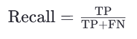
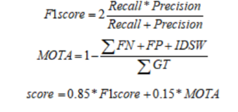

# 评分规则

# 1.**F1score**
 F1 Score（F1值）是一个常用的评估分类模型性能的指标，尤其是在二分类问题中。

它是精确率（Precision）和召回率（Recall）的**调和平均数**

 取值范围是从 0 到 1，其中 **1 表示最佳性能**，0 表示最差性能。

当模型既需要有高的精确率也需要有高的召回率时，F1 Score 是一个非常有用的指标

```python
 精确率（Precision）：在所有被模型预测为正类的样本中，实际为正类的比例。
 召回率（Recall）：在所有实际为正类的样本中，被模型正确预测为正类的比例。
 TP（True Positives）：真正例，即模型正确预测为正类的数量
 FP（False Positives）：假正例，即模型错误地将负类预测为正类的数量。
 FN（False Negatives）：假反例，即模型错误地将正类预测为负类的数量。
```




# 2.**MOTA**

MOTA（Multiple Object Tracking Accuracy）是**多目标跟踪精度**的指标，

用于评估计算机视觉系统或机器人系统中对多个物体进行跟踪的准确性。

它是一个综合性的度量标准，

考虑了误报（False Positives, FP）、

漏检（False Negatives, FN）、

ID Switches（身份切换错误）等因素。

```python
 GT 是 Ground Truth 的缩写，表示真实情况下的标签或位置信息。
 FN 是 False Negative 的缩写，表示未检测到但实际上存在的目标数量。
 FP 是 False Positive 的缩写，表示被错误地检测为目标但实际上不存在的对象的数量。
 IDSW 是 Identity Switch 的缩写，表示由于跟踪算法的错误而导致的目标身份混淆次数。
 MOTA 值越接近于 1，则说明跟踪系统的性能越好；反之，如果值越小甚至为负数，则说明跟踪系统的性能较差
```



# 3.评分标准

对每个json文件得到两个指标的加权求和，最终得分为所有文件得分取均值。

 注1：若真实目标框与预测框IOU大于0.5，则判定目标正确识别。若MOTA指标为负，则该类别精度得分为0。

 注2：若该视频中没有某个类别的目标，则此类别计算均值时，忽略该视频。