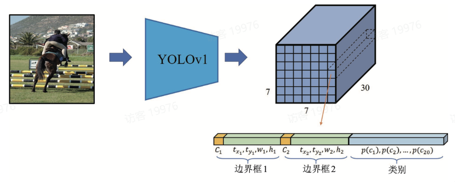
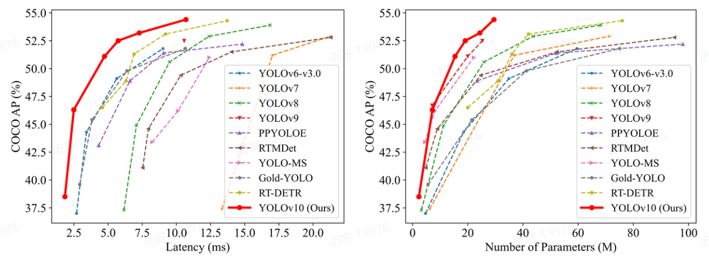
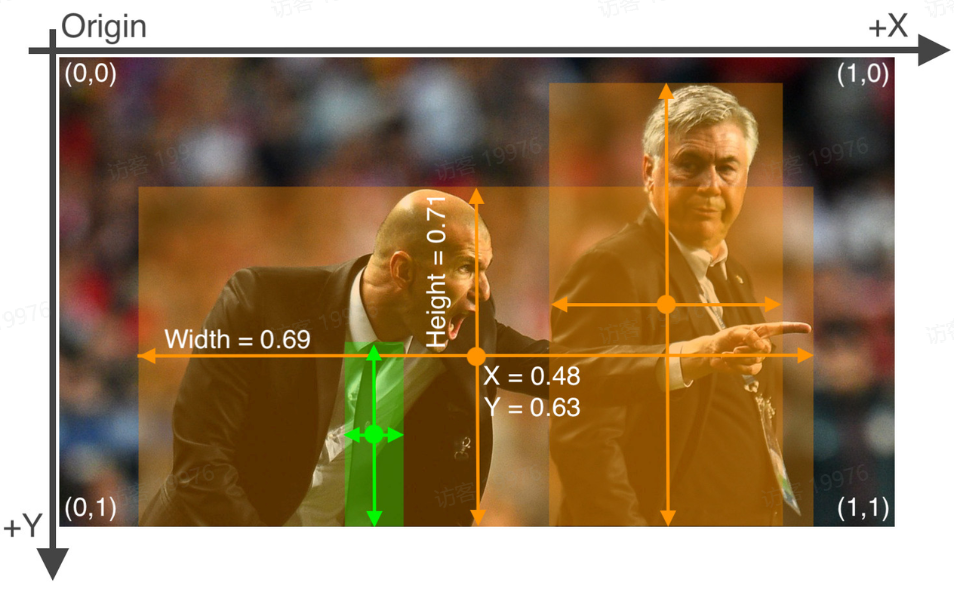
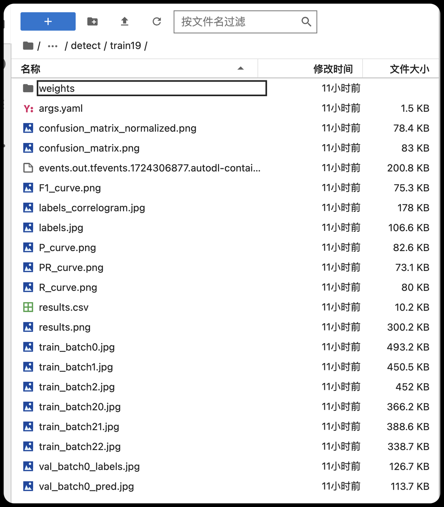
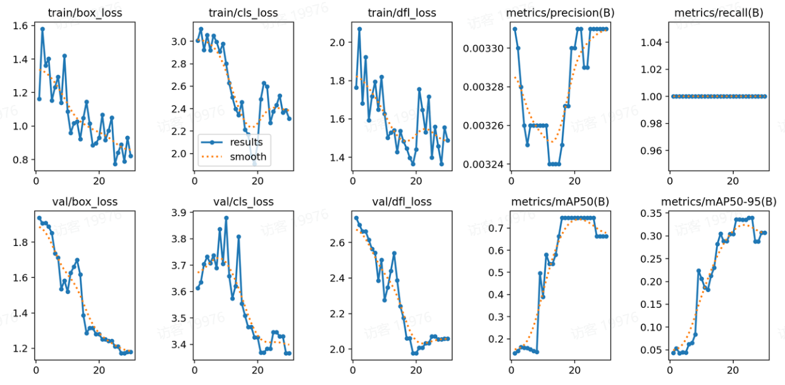
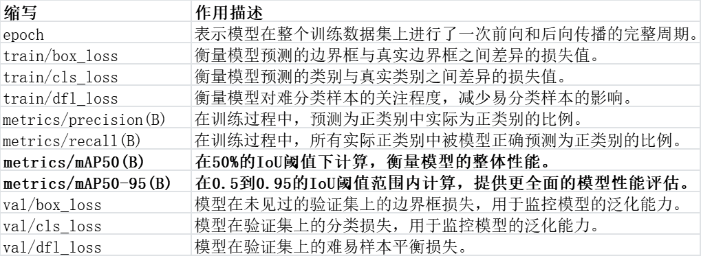
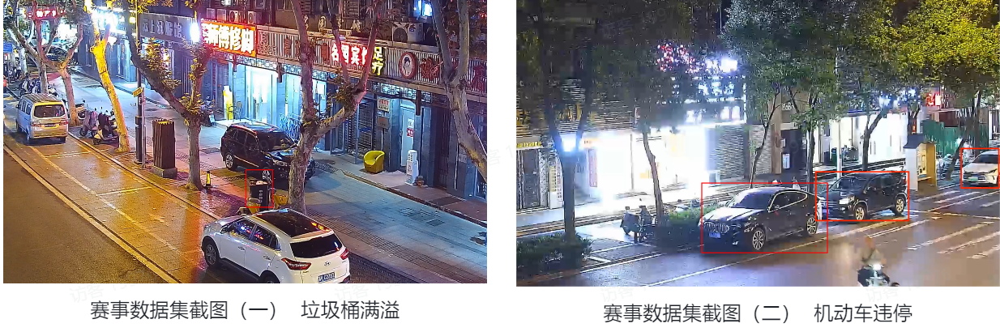
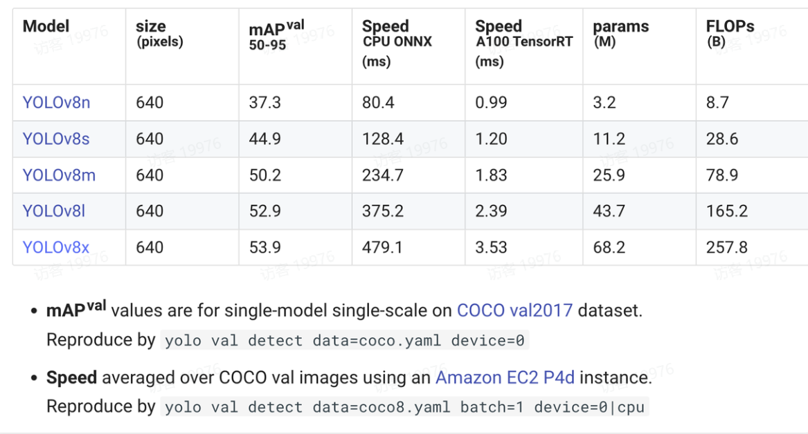

# YOLO

# 1.介绍

YOLO，全称为“**You Only Look Once**”（你只看一眼），是一种流行的实时目标检测系统，由Joseph Redmon等人在2015年提出。

YOLO模型的**核心思想**是将目标检测任务视为一个**单一的回归问**题，

通过一个卷积神经网络（**CNN**）直接从**图像像素**到**边界框坐标和类别概率的映射**。

YOLO模型经过了多次迭代，包括[YOLOv2](https://so.csdn.net/so/search?q=YOLOv2&spm=1001.2101.3001.7020)（YOLO9000）、YOLOv3和YOLOv4等版本，

每个版本都在性能和速度上有所提升，同时也引入了一些新的技术，如**更深的网络结构、更好的锚框机制、多尺度特征融合**等。

 在传统的两阶段方法中，首先会生成候选区域（Region Proposals），

然后对每个候选区域分别进行分类和边界框回归。

而YOLO则简化了这个过程，直接在一个网络中完成目标检测的所有任务。



# 2.YOLO模型的核心思想

 1.单一回归问题：在YOLO模型中，输入图像被分割成一个网格，

并且每个网格单元负责**预测其内部的物体及其边界框（Bounding Boxes）和类别概率**。

这种设计使得整个检测过程可以被视为一个端到端的回归问题，即从输入图像到输出边界框坐标和类别标签的直接映射。

 2.全局信息利用：由于YOLO模型在整个图像上运行一次，它可以**利用图像的全局信息来进行检测**，这有助于提高小物体和密集物体的检测能力。

 3.实时性：YOLO的设计目标之一是实现高速的实时检测。通过减少计算量和简化模型结构，YOLO可以在保证一定精度的情况下实现实时的处理速度。

 4.端到端训练：YOLO模型可以使用端到端的方式进行训练，这意味着不需要预先生成候选区域，而是**直接从原始图像学习到最终的检测结果**。

 5.统一框架：YOLO将**分类和定位的任务结合在一起**，避免了候选区域生成阶段，从而简化了整体架构并提高了效率。


# 3.特点

YOLO算法的一个显著特点是它在单个网络评估中**同时预测多个边界框和类别概率**，而不是像**传统的滑动窗口**方法那样多次评估。

YOLO使用一个**卷积神经网络（CNN）\**来提取图像特征，然后\**使用这些特征来预测边界框和类别概率**。

YOLO的网络结构通常包括**多个卷积层和池化层**。

YOLO为每个**边界框预测一个置信度**，这个置信度反映了边界框包含目标的**概率以及预测的类别**。

置信度的计算公式是：Pr(Object) * IOU(pred, truth)，

其中Pr(Object)表示格子中存在**目标的概率**，

IOU(pred, truth)表示**预测框和真实框的交并比**。


YOLO（You Only Look Once）是一种革命性的目标检测算法，以其快速和高效的性能而闻名。

自2015年YOLOv1的首次推出以来，YOLO系列已经经历了多次迭代，每一次迭代都在速度、准确性和计算效率方面做出了显著的贡献。

YOLOv1 2015 实时端到端物体检测，将检测视为回归问题，单次网络评估预测位置和类别。
 YOLOv2 2016 引入批量归一化，高分辨率分类器，全卷积网络，能检测超过9000个类别。

 YOLOv3 2018使用更深的Darknet-53网络，引入特征金字塔网络提高多尺度目标检测能力。
 YOLOv4 2020 结合CSPNet、PANet、SAM等技术，提高特征提取和检测效率。
 YOLOv5 2020 使用**Pytorch框架**，**不同大小模型版本适应不同环境**，易用性和性能显著改进。
 YOLOv6 2021 多种不同尺寸模型**适应工业应用**，继续在YOLO系列基础上改进。
 YOLOv7 2022 架构变化和一系列**免费包提高准确率**，保持实时性。
 YOLOv8 2023 新功能和改进，包括新的**骨干网络**、**Anchor-Free检测头**和**新损失函数**，提升性能和灵活性。
 YOLOv9 2023 引入可编程梯度信息（PGI）和基于梯度路径规划的通用高效层聚合网络（GELAN）架构。
 YOLOv10 2024 通过消除非最大抑制（NMS-Free）和优化各种模型组件，实现了最先进的性能。



YOLOv1至YOLOv3主要由Joseph Redmon及其合作者提出，

 而后续版本则由不同的研究者和团队负责开发。

 YOLOv4之后的版本，尤其是YOLOv5和YOLOv8，由Ultralytics公司开发和维护。

 YOLOv5和YOLOv8也是现在比较流行的版本。


# 4.YOLO 数据集格式


YOLO算法的标注格式主要使用.**txt文件**来存储图像中物体的标注信息。

 每个图像都有一个对应的.txt文件，

 文件中的每行表示一个物体的标注，

 包括物体的类别索引和边界框（bounding box）的坐标。


以下是YOLO标注格式的详细介绍：

1. 类别索引：每个物体的**类别**由一个**整数索引**表示，索引对应于**预先定义的类别列表**。
2. **边界框坐标**：边界框由其**中心点坐标**(x_center, y_center)和**宽度**width、**高度**height组成。这些值通常是归一化到图像宽度和高度的**比例值**，范围在0到1之间。
3. 坐标格式：边界框坐标通常按照[class_index x_center y_center width  height]的格式记录，其中class_index是类别索引，x_center和y_center是边界框中心点的x和y坐标，width和height是边界框的宽度和高度。



在YOLO的训练过程中，

 这样的**配置文件**允许用户轻松地指定数据集的位置和类别信息，

 从而**无需硬编码在训练脚本中**。


具体来说，这段配置的含义如下：

- path: 指定了**数据集的根目录路径**，即**所有数据子文件夹的上级目录**。这里的路径是相对于当前配置文件的路径或者相对于执行训练脚本的工作目录。
- train: 定义了**训练集图像**的相对路径。在训练模型时，程序会在指定的路径下查找图像文件。
- val: 定义了**验证集图像**的相对路径。验证集用于在训练过程中评估模型性能，避免过拟合。
- nc: 表示**类别**的数量，这里设置为2，意味着数据集中有**两类物体需要被识别**。
- names: 是一个**列表**，包含了**每个类别的名称**。这里有两个类别，名称分别是"0"和"1"。这些名称在训练和测试过程中用于引用特定的类别。

```python
# Train/val/test sets as 1) dir: path/to/imgs, 2) file: path/to/imgs.txt, or 3) list: [path/to/imgs1, path/to/imgs2, ..]
path: ../dataset/  # dataset root dir
train: images/train/  # train images (relative to 'path') 128 images
val: images/val/  # train images (relative to 'path') 128 images

# Classes
nc: 2  # number of classes
names: ["0", '1']  # class names

```

# 5.YOLO 训练日志

在使用YOLO进行训练时，生成的exp/detect/train类型的文件夹是训练过程中的一个关键组成部分。

- 模型权重 (.pt 或 .pth 文件): 训练过程中保存的**模型权重**，可以用于后续的测试或继续训练。
- 日志文件 (.log 文件): 包含训练过程中的所有**输出信息，如损失值、精度、速度等**。
- 配置文件 (.yaml 或 .cfg 文件): 训练时使用的配置文件副本，记录了**数据路径、类别名、模型架构等设置**。
- 图表和可视化: 有时YOLO会生成训练过程中的**性能图表，如损失曲线、精度曲线等**。
- 测试结果: 如果训练过程中包括了**测试阶段**，可能会有测试结果的保存，如**检测结果的图片或统计数据**。



1. F1_curve.png, PR_curve.png, P_curve.png, R_curve.png: 包含**模型性能的不同评估指标曲线图，如F1分数**(F1_curve.png)、精确率-召回率曲线(PR_curve.png)、精确率(P_curve.png)和召回率(R_curve.png)。
2. results.csv: 一个CSV文件，包含**模型训练或测试的结果数据**。
3. results.png: 包含训练结果的**汇总图表或图像**。
4. train_batch*.jpg: 包含训练过程中**不同批次的图像和它们的标注**。
5. val_batch0_labels.jpg, val_batch0_pred.jpg: **验证集批次的图像，可能包含真实标签(labels)和模型预测(pred)的可视化**。
6. weights/: 一个目录，通常包含模型训练过程中保存的**权重文件**，如.pt或.pth文件。

在训练过程中和训练完成后，都可以查看训练日志。

 可以优先查看results.png，图像的内容类似如下。

 从验证集上的损失 (val/box_loss, val/cls_loss, val/dfl_loss) 和性能指标可以评估模型在未见数据上的泛化能力。

 在下面的训练日志中，我们发现模型在验证集发生了过拟合。





# 6.为什么能发现模型在验证集发生了过拟合呢？

1. **损失函数的表现**：在训练数据集（train）上，各种损失函数（box_loss, cls_loss, df_loss）随着迭代次数的增加而持续下降，表明模型在训练集上学习得越来越好。然而，在**验证数据集**（val）上，尽管损失最初也在下降，但**随后稳定或略有上升**，这是**过拟合的典型标志**，意味着模型对未见过的数据泛化能力较差。
2. **精度和召回率**：从metrics/precision(B) 和 metrics/recall(B) 的图表来看，这些指标在训练集上波动较大，可能意味着模型在**尝试适应所有的训练样本**，**包括那些可能的噪声和非代表性的样本**。模型可能在尝试最小化训练误差的过程中过度调整其参数。，而在验证集上则呈现先上升后趋于平稳或下降的趋势，这种趋势表明模型的改进**主要集中在训练集特定的特征上**，而这些特征并**不适用于验证集**。模型在训练集上的表现改善没有在验证集上得到体现，也指示出过拟合，表明模型可能**过度专注于训练数据的特征**，而**缺乏足够的泛化性**。
3. **mAP指标**：mAP（Mean Average Precision）是衡量模型整体性能的重要指标。图中的metrics/mAP50(B) 和  metrics/mAP50-95(B)  显示，在训练集上这些指标持续改善，而在验证集上则达到一定高点后停滞或轻微下降，进一步证实了模型可能过拟合。

总结来说，模型在训练集上的性能持续提升，但这些改善未能有效转化到验证集上，反而出现性能停滞或下降，这些都是过拟合的表现。过拟合意味着模型过度学习了训练数据的特征及噪声，而没有捕捉到足够的泛化特征来对新的、未见过的数据进行准确预测。

# 7.YOLO优点

上面介绍了那么多关于YOLO的知识点，那我们为什么要选择YOLO这个模型而**不用其他的模型**呢？

1. **速度快**：YOLO的设计目标是实现快速的对象检测，它在保持相对高准确度的同时，能够实现高帧率的实时检测。

2. **易于实现**：YOLO的架构相对简单，易于理解和实现，这使得它在学术和工业界都得到了广泛的应用。

3. 版本迭代：YOLO自2016年首次发布以来，已经经历了多个版本的迭代（如YOLOv5、YOLOv6、YOLOv7等），每个版本都在性能和效率上有所提升。

4. **社区支持**：YOLO拥有一个活跃的开发者社区，提供了大量的教程、工具和预训练模型，这使得小白也可以快速上手并应用YOLO。

5. **灵活性**：YOLO的架构允许用户**根据特定需求调整网络结构**，例如改变**输入图像的尺寸**或**调整网络的深度**。

   

   我们回归赛题，赛题最终目标是开发一套智能识别系统，能够自动检测和分类城市管理中的违规行为。该系统应利用先进的图像处理和计算机视觉技术，通过对摄像头捕获的视频进行分析，自动准确识别违规行为，并及时向管理部门发出告警，以实现更高效的城市管理。





仔细分析，赛题的本质是其实就是通过选择合适的目标检测模型进行训练，

 并使用训练后的模型对城市内违规行为进行检测。

 由于实际应用场景中。需要模型对行为进行快速分析，

 因此我们抛弃了二阶段目标检测模型（Faster R-CNN、R-CNN等）

 选择了一阶段目标检测模型（YOLO、SSD等），

 同时我们不能一味的追求速度而忽略精度以及易于实践的实际需求，

 最终我们在众多一阶段目标检测模型中选择了YOLO模型。


# 8.不同模型的权重



1. **mAP (Mean Average Precision)提升**：从YOLOv8n到**YOLOv8x**，mAP从37.3%提升到53.9%。这表示模型的**精确度和召回率的平均表现有显著提高**，能够更准确地检测图像中的对象。
2. **推断速度**：随着模型性能的提升，推断时间也有所增加。例如，YOLOv8n的ONNX CPU推断时间为0.99毫秒，而YOLOv8x为3.53毫秒。这表明更高性能的模型在**处理速度上有所牺牲**。
3. **参数和计算量**：更高版本的YOLOv8（**如YOLOv8x**）模型参数数量和浮点运算次数（FLOPs）均大幅增加。这可能意味着**更高的内存和计算资源消耗**。


# 9.YOLO 模型训练参数


https://docs.ultralytics.com/usage/cfg/#train-settings

YOLO 模型的训练设置包括多种超参数和配置，这些设置会影响模型的性能、速度和准确性。

微调涉及采用预先训练的模型并调整其参数以提高特定任务或数据集的性能。

该过程也称为模型再训练，使模型能够更好地理解和预测在实际应用中将遇到的特定数据的结果。

您可以根据模型评估重新训练模型，以获得最佳结果。

通常，在初始训练时期，学习率从低开始，逐渐增加以稳定训练过程。

但是，由于您的模型已经从以前的数据集中学习了一些特征，因此立即从更高的学习率开始可能更有益。

在 YOLO 中绝大部分参数都可以使用默认值。

1. imgsz: 训练时的目标图像尺寸，所有图像在此尺寸下缩放。
2. save_period: 保存模型检查点的频率（周期数），-1 表示禁用。
3. device: 用于训练的计算设备，可以是单个或多个 GPU，CPU 或苹果硅的 MPS。
4. optimizer: 训练中使用的优化器，如 SGD、Adam 等，或 ‘auto’ 以根据模型配置自动选择。
5. momentum: SGD 的动量因子或 Adam 优化器的 beta1。
6. weight_decay: L2 正则化项。
7. warmup_epochs: 学习率预热的周期数。
8. warmup_momentum: 预热阶段的初始动量。
9. warmup_bias_lr: 预热阶段偏置参数的学习率。
10. box: 边界框损失在损失函数中的权重。
11. cls: 分类损失在总损失函数中的权重。
12. dfl: 分布焦点损失的权重。

在YOLOv5及其后续版本中，imgsz可以被设置为一个整数，用于训练和验证模式，表示将输入图像调整为正方形的尺寸，例如imgsz=640意味着图像将被调整为640x640像素。

对于预测和导出模式，imgsz可以被设置为一个列表，包含宽度和高度, 例如imgsz=[640, 480]，表示图像将被调整为640像素宽和480像素高。

**较大的图像尺寸**可能会提高模型的**准确性**，但会增加计算量和内存消耗。

较小的图像尺寸可能会降低模型的准确性，但会提高计算速度和内存效率。

因此，用户应根据实际场景需求及硬件资源限制，设置合适的输入图像尺寸

# 10.YOLO 模型预测行为和性能

YOLO模型的预测结果通常包括多个组成部分，每个部分提供关于检测到的对象的不同信息。

同时 YOLO 能够处理。包括单独图像、图像集合、视频文件或实时视频流在内的多种数据源，也能够一次性处理多个图像或视频帧，进一步提高推理速度。

```python
from ultralytics import YOLO

# Load a model
model = YOLO("yolov8n.pt")  # pretrained YOLOv8n model

# Run batched inference on a list of images
results = model(["im1.jpg", "im2.jpg"])  # return a list of Results objects

# Process results list
for result in results:
    boxes = result.boxes  # Boxes object for bounding box outputs
    masks = result.masks  # Masks object for segmentation masks outputs
    keypoints = result.keypoints  # Keypoints object for pose outputs
    probs = result.probs  # Probs object for classification outputs
    obb = result.obb  # Oriented boxes object for OBB outputs
    result.show()  # display to screen
    result.save(filename="result.jpg")  # save to disk

```

| 属性       | 描述                                           |
| ---------- | ---------------------------------------------- |
| cls        | 类别概率，表示当前预测结果属于类别0的概率为0。 |
| conf       | 置信度，模型对其预测结果的置信度，接近92%。    |
| data       | 包含边界框坐标和置信度以及类别概率的原始数据。 |
| id         | 没有分配唯一的对象ID。                         |
| is_track   | 预测结果不是来自跟踪的对象。                   |
| orig_shape | 输入图像的原始尺寸，这里是500x500像素。        |
| shape      | 预测结果张量的形状，表示一个边界框的六个值。   |
| xywh       | 归一化的边界框坐标，中心坐标和宽高。           |
| xywhn      | 归一化的边界框坐标（无偏移）。                 |
| xyxy       | 原始边界框坐标，左上角和右下角坐标。           |
| xyxyn      | 归一化的原始边界框坐标。                       |

YOLOv8模型的使用者提供了灵活性，允许根据特定应用场景的需求调整模型的行为和性能。

例如，如果需要减少误报，可以提高conf阈值；

如果需要提高模型的执行速度，可以在支持的硬件上使用half精度；

如果需要处理视频数据并希望加快处理速度，可以调整vid_stride来跳过某些帧。

| 参数名  | 类型         | 默认值 | 描述                                                         |
| ------- | ------------ | ------ | ------------------------------------------------------------ |
| conf    | float        | 0.25   | 置信度阈值，用于设置检测对象的最小置信度。低于此阈值的检测对象将被忽略。调整此值有助于减少误报。 |
| iou     | float        | 0.7    | 非最大值抑制（NMS）的交并比（IoU）阈值。较低的值通过消除重叠的边界框来减少检测数量，有助于减少重复项。 |
| imgsz   | int 或 tuple | 640    | 推理时定义图像的大小。可以是单个整数（如640），用于将图像大小调整为正方形，或 (height, width) 元组。合适的尺寸可以提高检测精度和处理速度。 |
| augment | bool         | FALSE  | 启用预测时的数据增强（TTA），可能通过牺牲推理速度来提高检测的鲁棒性。 |

