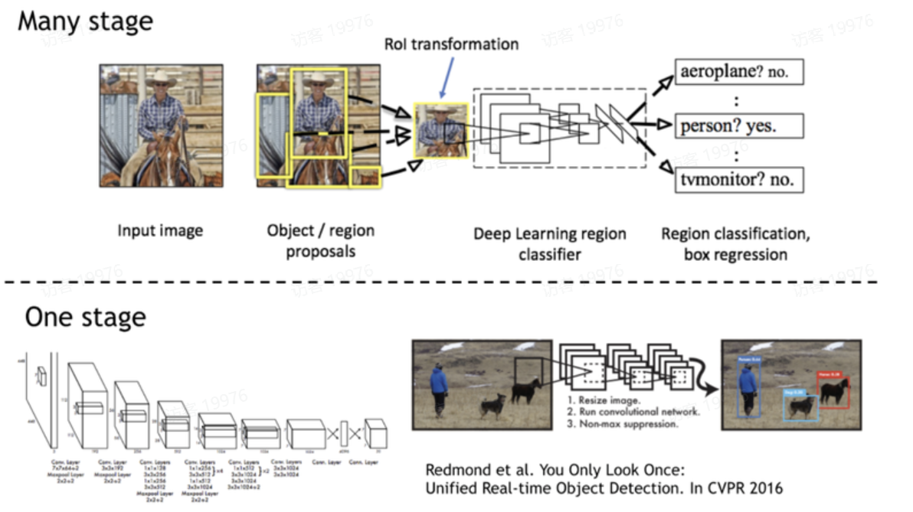

# 6.物体检测

# 1.背景介绍

物体检测是计算机视觉领域的一个重要任务，它的目标是在图像或视频帧中识别和定位感兴趣的物体。

物体检测算法不仅要识别图像中的对象属于哪个类别，还要确定它们在图像中的具体位置，通常以**边界框**（bounding box）的形式表示。

以下是物体检测的一些关键概念和步骤：

1. 输入：物体检测算法的输入通常是一张**图像或视频帧**。
2. 特征提取：算法使用**深度学习模型（如卷积神经网络CNN）来提取图像的特征**。这些特征捕捉了图像中的视觉信息，为后续的物体识别和定位提供基础。
3. **候选区域生成**：在某些检测算法中，如**基于区域的卷积神经网络（R-CNN）及其变体**，首先需要生成图像中的候选区域，这些区域可能包含感兴趣的物体。
4. 区域分类和边界框回归：对于每个候选区域，**算法需要判断它是否包含特定类别的物体**，并预测**物体的边界框**。这通常涉及到**分类任务和回归任务的结合**。
5. **非极大值抑制（NMS）**：在检测过程中，可能会产生多个**重叠的边界框，用于表示同一物体**。NMS是一种常用的技术，用于选择**最佳的边界框并去除多余的框**。

# 2.物体检测算法分类

物体检测算法主要分为两类：One-Stage（一阶段）和Two-Stage（两阶段）模型。

- One-Stage模型，如**YOLO**（You Only Look Once）和**SSD**（Single Shot Detection），直接在单次网络评估中预测图像中**所有物体的类别和位置信息**。这种方法的优点是**速度快，适合实时应用**，但可能在**精度上不如Two-Stage模型** 。
- Two-Stage模型，如**Faster R-CNN**，首先使用**区域提议网络**（Region Proposal Network, RPN）生成候选区域，然后对这些区域进行**分类和边界框的精细调整**。这种方法的优点是**精度高，但速度相对较慢** 。
    One-Stage模型通常在单个卷积网络中同时预测类别和位置，而Two-Stage模型则将检测任务分解为两个阶段：区域提议和候选区域的分类与定位。One-Stage模型因为省略了区域提议步骤，所以能够实现更快的检测速度，但这可能会以牺牲一些精度为代价。相比之下，Two-Stage模型通过两步过程提高了检测的准确性，但同时也增加了计算的复杂性和时间消耗 。

在实际应用中，选择哪种模型取决于特定场景的需求。如果对速度有较高要求，如**视频流处理或实时监控**，**One-Stage模型可能更合适**。如果对精度有更高要求，如在需要**高精度识别的科研或专业领域**，Two-Stage模型可能更加适用 。

