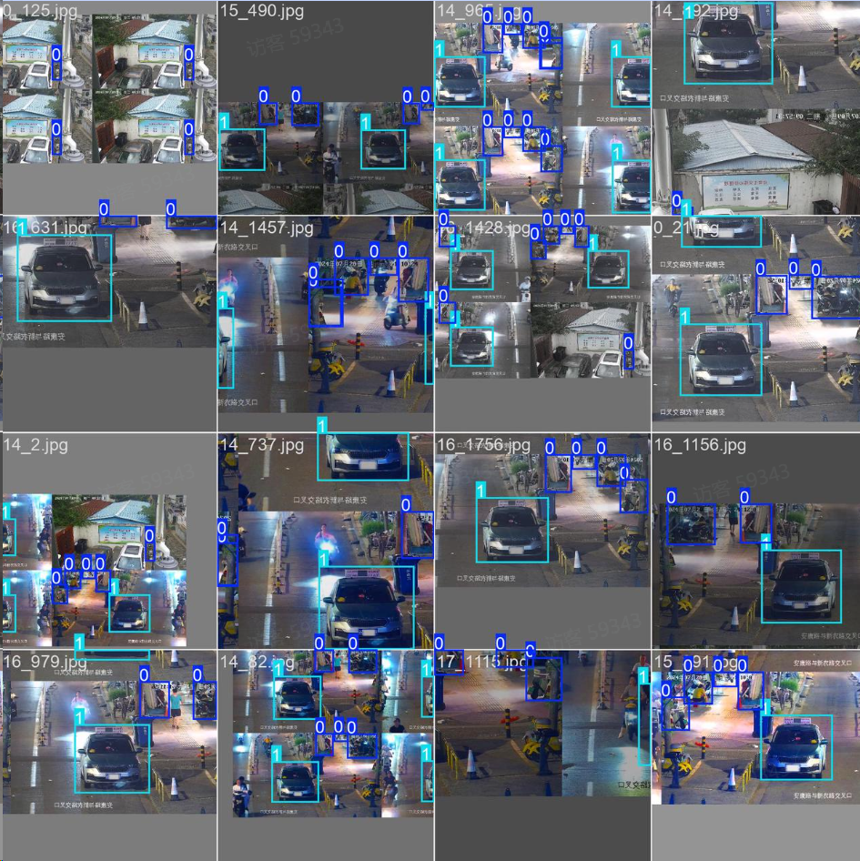

# 7.数据增强

# 1.介绍

数据增强是机器学习和深度学习中常用的技术，

 用于通过从现有数据集中生成新的训练样本来提高模型的泛化能力。

 干净一致的数据对于创建性能良好的模型至关重要。

 常见的增强技术包括**翻转、旋转、缩放和颜色调整**。

 多个库，例如 **Albumentations、Imgaug 和 TensorFlow的 ImageDataGenerator**，可以生成这些增强。

# 2.数据增强方法 描述

 Mosaic Augmentation 将四张训练图像组合成一张，增加物体尺度和位置的多样性。
 Copy-Paste Augmentation 复制一个图像的随机区域并粘贴到另一个图像上，生成新的训练样本。
 Random Affine Transformations 包括图像的随机旋转、缩放、平移和剪切，增加对几何变换的鲁棒性。
 MixUp Augmentation 通过线性组合两张图像及其标签创造合成图像，增加特征空间的泛化。
 Albumentations 一个支持多种增强技术的图像增强库，提供灵活的增强管道定义。
 HSV Augmentation 对图像的色相、饱和度和亮度进行随机变化，改变颜色属性。
 Random Horizontal Flip 沿水平轴随机翻转图像，增加对镜像变化的不变性。

如下图所示，是一个数据集增强的效果示例，针对原有数据集进行了翻转、随机拼贴、剪切等处理：

| 参数名       | 类型  | 默认值      | 取值范围    | 描述                                                         |
| ------------ | ----- | ----------- | ----------- | ------------------------------------------------------------ |
| hsv_h        | float | 0.015       | 0.0 - 1.0   | 调整图像色调，引入颜色变异性，提高不同光照下的泛化能力。     |
| hsv_s        | float | 0.7         | 0.0 - 1.0   | 调整图像饱和度，改变颜色强度，模拟不同环境条件。             |
| hsv_v        | float | 0.4         | 0.0 - 1.0   | 调整图像亮度，帮助模型在不同光照下表现良好。                 |
| degrees      | float | 0           | -180 - +180 | 随机旋转图像，提高识别不同方向物体的能力。                   |
| translate    | float | 0.1         | 0.0 - 1.0   | 平移图像，帮助模型学习检测部分可见物体。                     |
| scale        | float | 0.5         | ≥0.0        | 缩放图像，模拟物体与相机之间的不同距离。                     |
| shear        | float | 0           | -180 - +180 | 剪切图像，模拟从不同角度观察物体的效果。                     |
| perspective  | float | 0           | 0.0 - 0.001 | 应用随机透视变换，增强模型对3D空间物体的理解能力。           |
| flipud       | float | 0           | 0.0 - 1.0   | 上下翻转图像，增加数据变异性，不影响物体特征。               |
| fliplr       | float | 0.5         | 0.0 - 1.0   | 左右翻转图像，有助于学习对称物体和增加数据集多样性。         |
| bgr          | float | 0           | 0.0 - 1.0   | 翻转图像通道从RGB到BGR，提高对通道顺序错误的鲁棒性。         |
| mosaic       | float | 1           | 0.0 - 1.0   | 合成四张图像，模拟不同场景组合和物体交互，增强复杂场景理解。 |
| mixup        | float | 0           | 0.0 - 1.0   | 混合两张图像及标签，创建合成图像，增强泛化能力。             |
| copy_paste   | float | 0           | 0.0 - 1.0   | 复制物体并粘贴到另一图像，增加实例和学习遮挡。               |
| auto_augment | str   | randaugment | -           | 自动应用预定义增强策略，优化分类任务。                       |
| erasing      | float | 0.4         | 0.0 - 0.9   | 随机擦除图像部分，鼓励模型关注不明显特征。                   |